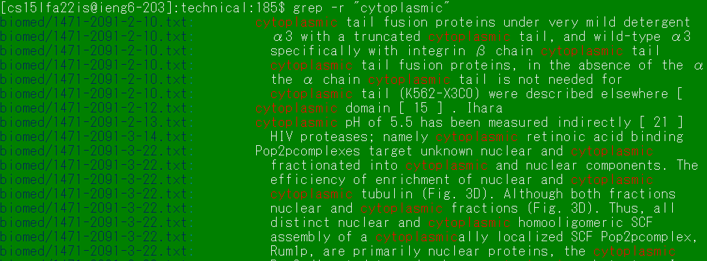
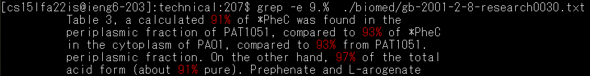

# Week 5 Lab Report

## The "grep" command
grep is used to find strings or patterns in a file. 

## grep -r
`grep -r` uses grep recursively through a directory, searching for a term in any file in the chosen directory.

---

grep used without -r searches through one file.

As you can see, grep without -r shows all the instances of `cytoplasmic` in red. All instances are in "gb-2002-4-1-r2.txt".

---

This second call uses -r and includes all instances of `cytoplasmic` in the directory `./biomed/`. The name of the file is left of the line output. The screenshot includes only part of the output.

---

If no instances of the term is found, nothing is printed.

---

Grep without -r needs a filename as an argument. If when using `grep -r`, if no file name argument is provided then it will default on the current directory. As you can see, the output now includes files from `./biomed/` and also `./plos/`.

## grep -n
`grep -n` includes the line number which the term(s) are found. This is especially useful for longer files with multiple instances of the term.

---

`cytoplasmic` is seen many times in this file, but we can see which line numbers they appear in. 

--- 

You could use this to find references to Figures, for example, in an academic paper.

---

You can run `grep -r -n` to recursively find a term in a directory with multiple files, and also include the line number in each of those files. This gives a very detailed view on each occurence of the searched term.

## grep -e

The `grep -e` finds patterns instead of string literals, which is extremely versatile.

---

Say you're research wants you to find effects of plasm and enzymes. You could manually search for `plasm` and `enzyme`, or you can search a pattern of plasm AND enzyme in just one line.

---

There are many patterns you can plug in. `.` is the wildcard pattern, which means any character. For example, if only want lines that have high percentage for something, i.e. 90% or more, you could use the pattern `9.%`. 

---

You could combine the use of multiple patterns, line numbers, and the recursively argument to find all instances of 90% or 100% in all the files of `./biomed/`.

This shows how powerful using command line options of grep can be, and the versatility of the how linux terminal commands could be.